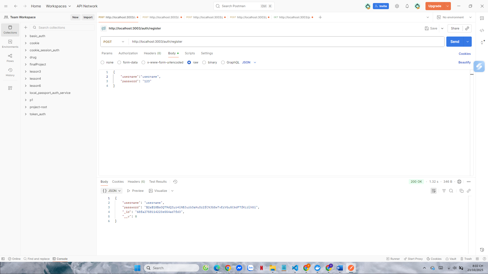
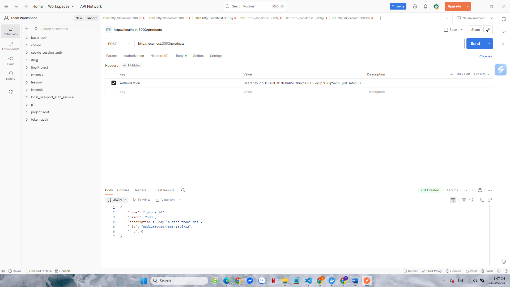
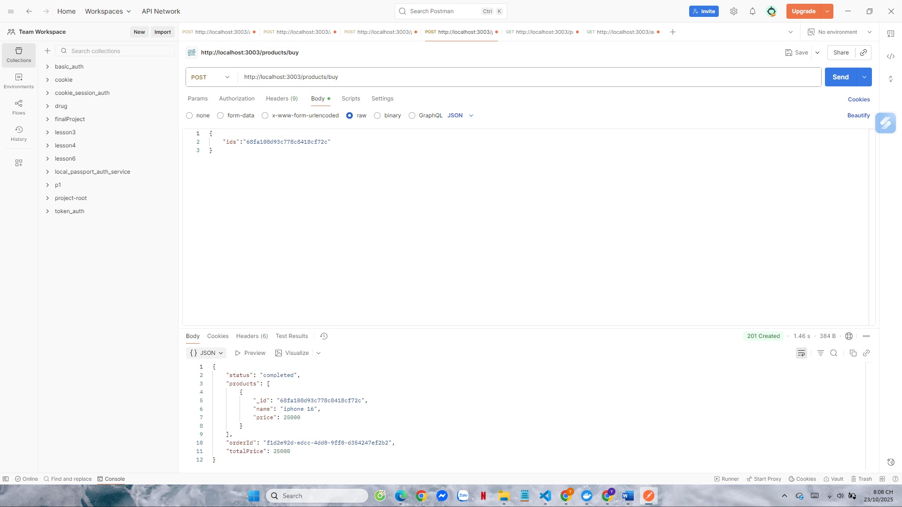
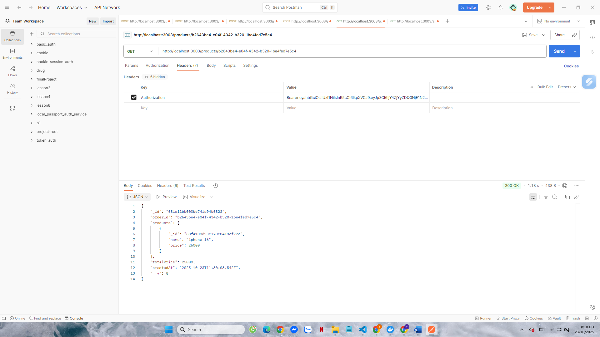

# DỰ ÁN: Hệ thống phần mềm thương mại điện tử dựa trên kiến trúc dịch vụ vi mô
**Tác giả:** Lý Thị Yến  
**MSSV:** 22665891  
**Môn học:** Lập trình hướng dịch vụ  
**Tên dự án:** EProject Phase 1 – Microservices E-Commerce System
---

## I. Giới thiệu tổng quan

Dự án này được xây dựng nhằm mục tiêu phát triển một **hệ thống thương mại điện tử có khả năng mở rộng**, áp dụng **kiến trúc Microservices**, cho phép các thành phần hoạt động độc lập nhưng có thể giao tiếp thông qua **RabbitMQ Message Broker**.  
Mỗi service đảm nhận một nghiệp vụ riêng biệt: xác thực người dùng, quản lý sản phẩm, xử lý đơn hàng và điều phối yêu cầu thông qua **API Gateway**.

---

## II. Công nghệ sử dụng

| Thành phần          | Công nghệ                   |
| ------------------- | --------------------------- |
| Ngôn ngữ            | Node.js (Express Framework) |
| Cơ sở dữ liệu       | MongoDB                     |
| Message Queue       | RabbitMQ                    |
| Kiến trúc           | Microservices               |
| Containerization    | Docker, Docker Compose      |
| CI/CD               | GitHub Actions              |
| Kiểm thử            | Mocha, Chai, Chai-HTTP      |
| Cấu hình môi trường | dotenv                      |

---

## III. Kiến trúc hệ thống (System Architecture)

                API Gateway (Port 3003)
                        |
   -----------------------------------------------------
   |                    |                    |
   
 Auth Service      Product Service       Order Service
   (3000)               (3001)                (3002)
   
   |                    |                    |
   ----------------------|--------------------
                         |
                  MongoDB, RabbitMQ
---

## IV. Cấu trúc thư mục dự án
EProject-Phase-1/
│
├── api-gateway/
│   ├── src/
│   │   ├── routes/
│   │   │   └── gatewayRoutes.js
│   │   ├── utils/
│   │   │   ├── messageBroker.js
│   │   │   └── isAuthenticated.js
│   │   └── app.js
│   ├── Dockerfile
│   ├── package.json
│   └── .env
│
├── auth/
│   ├── src/
│   │   ├── controllers/
│   │   │   └── authController.js
│   │   ├── models/
│   │   │   └── user.js
│   │   ├── routes/
│   │   │   └── authRoutes.js
│   │   ├── utils/
│   │   │   └── jwtHelper.js
│   │   ├── test/
│   │   │   └── authController.test.js
│   │   └── app.js
│   ├── Dockerfile
│   ├── package.json
│   └── .env
│
├── order/
│   ├── src/
│   │   ├── controllers/
│   │   │   └── orderController.js
│   │   ├── models/
│   │   │   └── order.js
│   │   ├── routes/
│   │   │   └── orderRoutes.js
│   │   ├── services/
│   │   │   └── orderService.js
│   │   ├── test/
│   │   │   └── order.test.js
│   │   └── utils/
│   │       ├── messageBroker.js
│   │       └── isAuthenticated.js
│   ├── Dockerfile
│   ├── package.json
│   └── .env
│
├── product/
│   ├── public/
│   │   └── results/
│   │       ├── buy_product_success.png
│   │       ├── create_product_success.png
│   │       ├── create_product_fail.png
│   │       ├── get_products.png
│   │       └── no_token.png
│   ├── src/
│   │   ├── controllers/
│   │   │   └── productController.js
│   │   ├── models/
│   │   │   └── product.js
│   │   ├── repositories/
│   │   │   └── productsRepository.js
│   │   ├── routes/
│   │   │   └── productRoutes.js
│   │   ├── services/
│   │   │   └── productsService.js
│   │   ├── test/
│   │   │   └── product.test.js
│   │   └── utils/
│   │       ├── messageBroker.js
│   │       └── isAuthenticated.js
│   ├── Dockerfile
│   ├── package.json
│   └── .env
│
├── docker-compose.yml
├── .github/
│   └── workflows/
│       └── ci-cd.yml
├── README.md
└── .gitignore

---

## V. Mô tả chi tiết hệ thống

### 1. Vấn đề hệ thống giải quyết
Hệ thống cung cấp nền tảng **thương mại điện tử vi mô**, nơi người dùng có thể đăng ký, đăng nhập, xem sản phẩm và đặt hàng.  
Các dịch vụ hoạt động độc lập giúp hệ thống **dễ bảo trì, dễ mở rộng và triển khai tự động** qua Docker & GitHub Actions.

### 2. Các dịch vụ chính
- **Auth Service**: Xác thực người dùng, quản lý JWT token.  
- **Product Service**: CRUD sản phẩm, danh mục.  
- **Order Service**: Tạo và quản lý đơn hàng, giao tiếp qua RabbitMQ.  
- **API Gateway**: Cổng trung gian, định tuyến và xác thực request.

### 3. Các mẫu thiết kế áp dụng
- Microservices Architecture  
- Clean Architecture  
- Message Queue Pattern (RabbitMQ)  
- API Gateway Pattern  
- JWT Authentication Pattern

### 4. Giao tiếp giữa các dịch vụ
- **Auth, Product, Order** giao tiếp qua API Gateway (HTTP).  
- **Product ↔ Order** giao tiếp bất đồng bộ thông qua RabbitMQ.

---

## VI. Thực thi trên Docker

Khởi động toàn bộ hệ thống:
docker-compose up --build

Dừng container:
docker-compose down

Khi test, chứng minh rằng Postman đang gọi đến các dịch vụ trên Docker container bằng cách kiểm tra MongoDB container:
docker exec -it mongodb mongosh
show dbs
use auth_db
db.users.find().pretty()

---
## VII. Hướng dẫn kiểm thử với Postman
1. Đăng ký tài khoản người dùng

Endpoint:
POST http://localhost:3003/auth/register
  
Sau khi gửi request, kiểm tra MongoDB container để xác nhận user được lưu vào auth_db.

---
2. Đăng nhập

Endpoint:
POST http://localhost:3003/auth/login
  
Lưu lại token trả về để dùng cho các API tiếp theo.

---
3. Tạo sản phẩm mới

Endpoint:
POST http://localhost:3003/products
  

---
4. Đặt hàng

Endpoint:
POST http://localhost:3003/products/buy
  
Product Service gửi message qua RabbitMQ → Order Service tiêu thụ, lưu hóa đơn vào DB.

---

5. Lấy thông tin hóa đơn theo ID

Endpoint:
GET http://localhost:3003/products/:id

---
## VIII. Kiểm thử và CI/CD

Kiểm thử tự động bằng Mocha + Chai.

CI/CD thực hiện với GitHub Actions:

Test – chạy npm test cho từng service.

Build & Push – build Docker image và push lên Docker Hub.

Deploy – khởi động container qua docker-compose.

