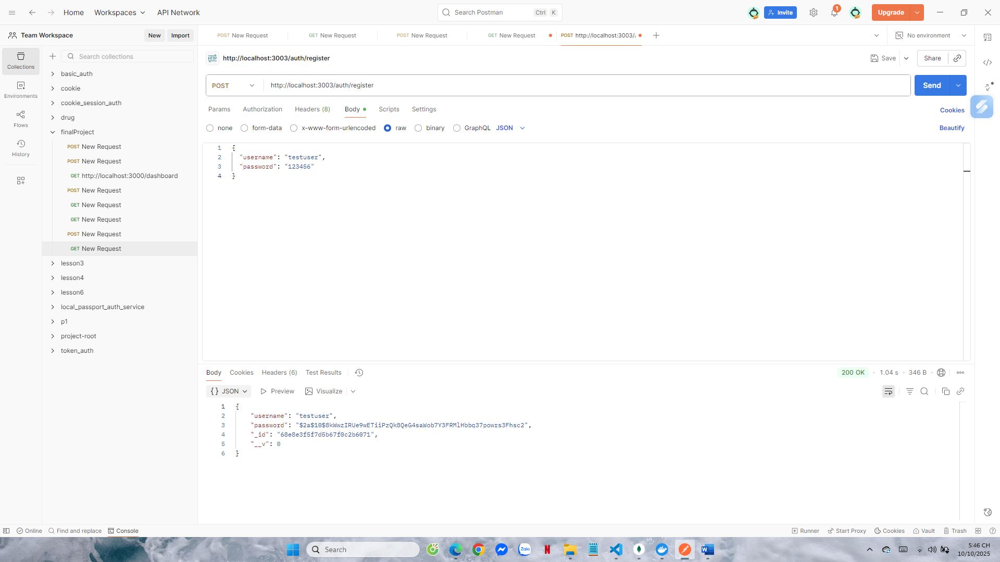
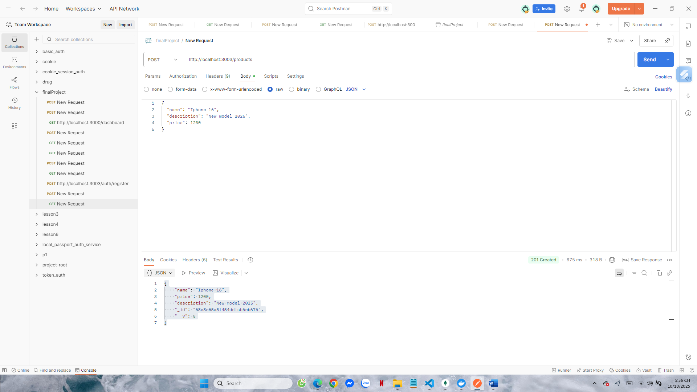

# API Gateway

## Giới thiệu
Service **API Gateway** chịu trách nhiệm trung gian giữa các microservice trong hệ thống, bao gồm:
- **Auth Service (cổng 3000)**: Đăng ký, đăng nhập, xác thực người dùng.
- **Product Service (cổng 3001)**: Quản lý sản phẩm, mua hàng.
- **Order Service (cổng 3002)**: Tiếp nhận đơn hàng qua RabbitMQ.

Gateway định tuyến các request đến đúng service tương ứng thông qua cơ chế **HTTP Proxy**.

---

## Cách chạy

1. Cài đặt thư viện:
   ```bash
   npm install
   ```

2. Chạy service:
   ```bash
   node index.js
   ```

3. Nếu chạy thành công, console sẽ hiển thị:
   ```
   API Gateway listening on port 3003
   ```

---

## 1. Đăng ký tài khoản (Auth Service)
**API:** `POST http://localhost:3000/register`  
📸 *Ảnh minh chứng:*  


---

## 2️. Đăng nhập tài khoản (Auth Service)
**API:** `POST http://localhost:3000/login`  
📸 *Ảnh minh chứng:*  

---

## 3️. Tạo sản phẩm mới (Product Service)
**API:** `POST http://localhost:3001/api/products`  

### Kết quả test
- **Hiện tại Order Service chỉ hoạt động qua RabbitMQ** nên không có API HTTP để xử lý request.  
  Gateway chuyển tiếp request nhưng không tìm thấy route tương ứng.  
  

→ Kết quả hiển thị:  
```
Cannot GET /api/orders
```
Điều này chứng minh Gateway **vẫn hoạt động đúng**, chỉ là service đích không có endpoint HTTP.

---

## Cấu trúc thư mục
```
api-gateway/
│
├── index.js
├── package.json
├── public/
│   └── results/
│       ├── buy_product.png
│       ├── create_product.png
│       ├── login.png
│       ├── orders_list.png
│       └── register.png
```

---

## Tổng kết
| Thành phần | Cổng | Trạng thái | Mô tả |
|-------------|------|-------------|--------|
| Auth Service | 3000 | ✅ Hoạt động | Đăng ký & đăng nhập |
| Product Service | 3001 | ✅ Hoạt động | Quản lý sản phẩm |
| Order Service | 3002 | ⚙️ Chỉ qua RabbitMQ | Lưu đơn hàng, chưa có API HTTP |
| API Gateway | 3003 | ✅ Hoạt động | Kết nối các service trên |

```
Gateway định tuyến:
 /auth     → http://localhost:3000
 /products → http://localhost:3001/api/products
 /orders   → http://localhost:3002/api/orders
```
---

