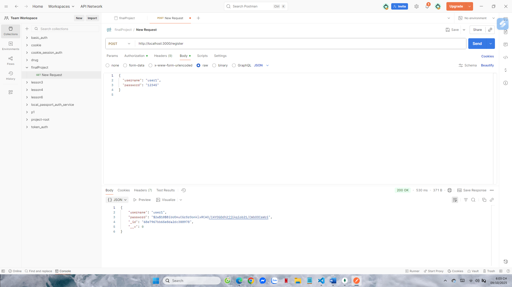
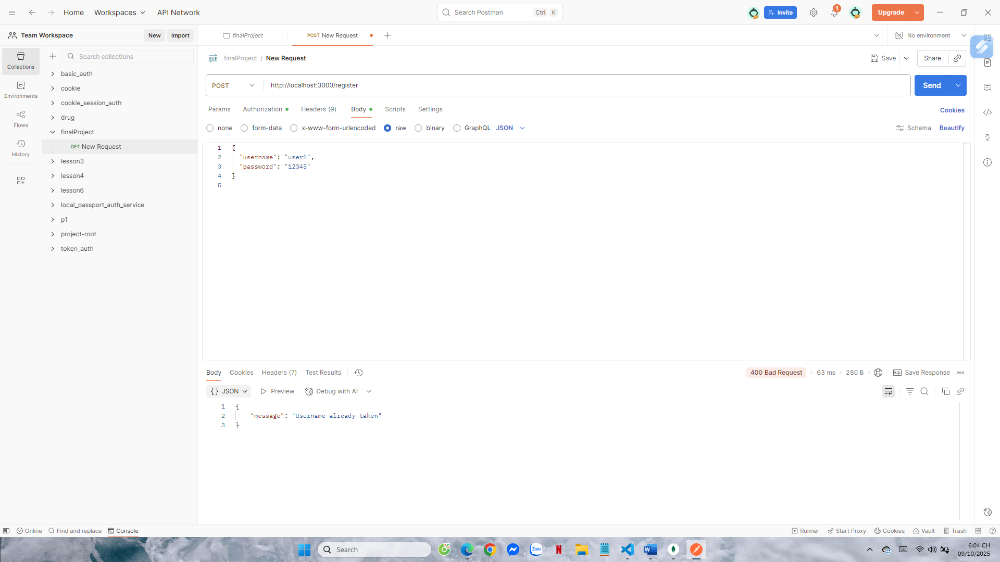
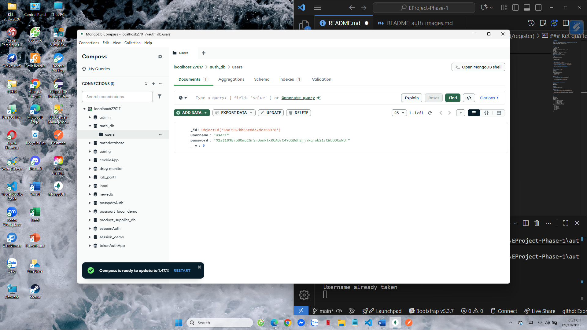
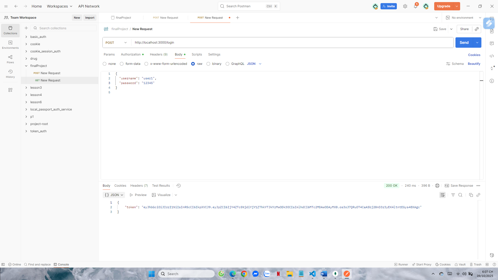
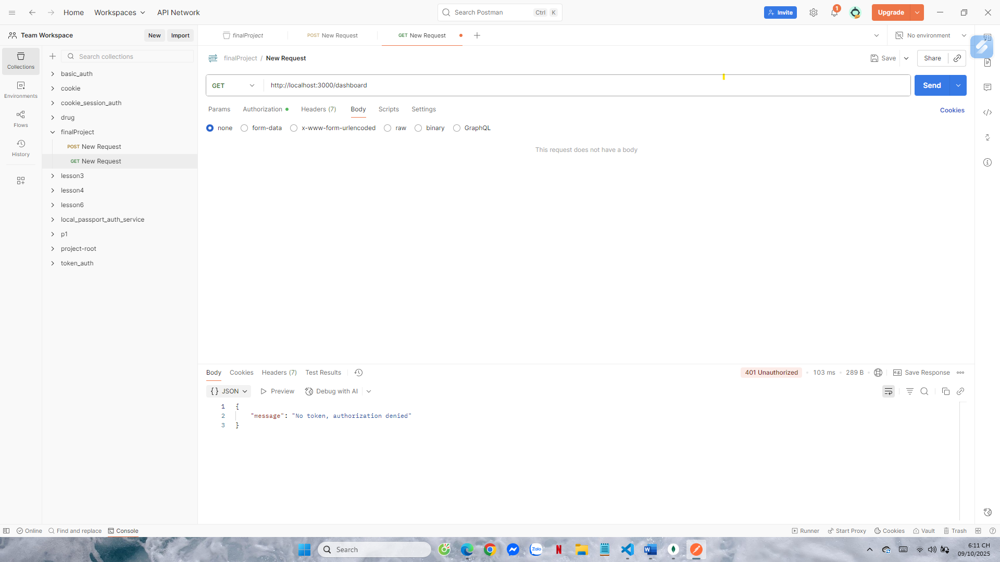
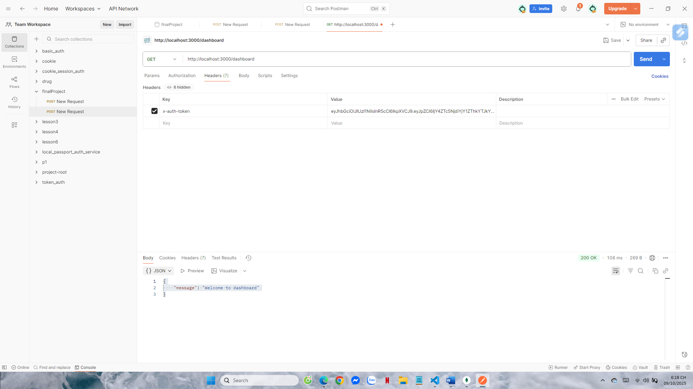

# Auth Service

## Giới thiệu
Service `auth` chịu trách nhiệm **đăng ký**, **đăng nhập**, và **xác thực người dùng** bằng **JWT Token**.  
Các API được bảo vệ bằng middleware xác thực.

---

## Cách chạy

1. Cài đặt thư viện:
   ```bash
   npm install
2. Tạo file .env trong thư mục auth/ với nội dung:
MONGO_URI=
JWT_SECRET=
3. Chạy service:
node index.js
4. Nếu chạy thành công, console sẽ hiển thị:
MongoDB connected
Server started on port 3000

## Part A: Register User (`/register`)

### Request
```http
POST /register
Content-Type: application/json
{
  "username": "user1",
  "password": "12345"
}
```

### Kết quả test
- **Gửi đúng thông tin** → `200 OK`  
  

- **Trùng username hoặc thiếu thông tin** → `400 Bad Request`  
  

- **Kiểm tra trong MongoDB (collection users)**  
  

---

## Part B: Login User (`/login`)

### Request
```http
POST /login
Content-Type: application/json
{
  "username": "user1",
  "password": "12345"
}
```

### Kết quả test
- **Đăng nhập đúng thông tin** → trả về token JWT  
  

- **Sai username/password** → `401 Unauthorized`  
  

---

## Part C: Dashboard (Protected Route)

### Request
```http
GET /dashboard
```

### Header
```
x-auth-token: <token từ login>
```

### Kết quả test
- **Chưa gửi token** → `401 No token, authorization denied`  
  

- **Token hợp lệ** → `200 OK`, hiển thị thông điệp chào mừng  
  

---

## Cấu trúc thư mục
```
auth/
│
├── index.js
├── .env
├── package.json
├── public/
│   └── results/
│       ├── register_success.png
│       ├── register_fail.png
│       ├── mongo_register.png
│       ├── login_success.png
│       ├── login_fail.png
│       ├── dashboard_no_token.png
│       └── dashboard_with_token.png
└── src/
    ├── app.js
    ├── config/
    ├── controllers/
    ├── middlewares/
    ├── models/
    ├── repositories/
    ├── services/
    └── test/
```

---