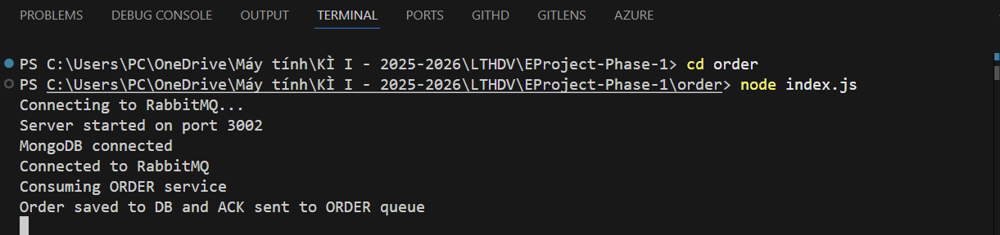
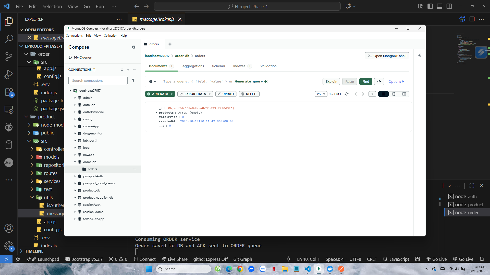
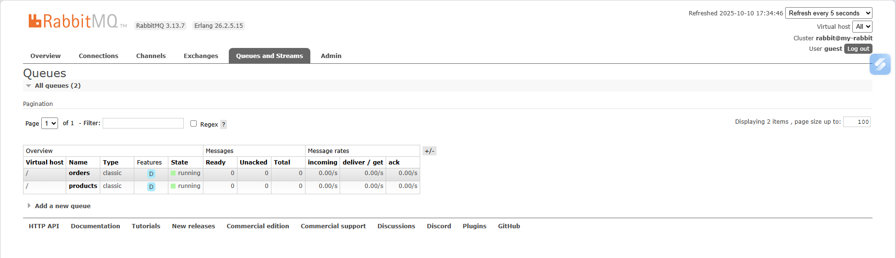

# ORDER SERVICE

## 1. Mục tiêu
Service này dùng để quản lý đơn hàng trong hệ thống E-commerce.  
Chức năng chính:
- Nhận message từ RabbitMQ queue `orders` (gửi từ Product Service)
- Lưu thông tin đơn hàng vào MongoDB
- Gửi phản hồi lại qua queue `products` sau khi lưu thành công

---

## 2. Cấu trúc file chính

```
src/
│
├── models/
│   └── order.js           # Định nghĩa schema Order
│
├── utils/
│   ├── isAuthenticated.js # Xác thực JWT
│   └── messageBroker.js   # Kết nối và thao tác RabbitMQ
│
├── config.js              # Cấu hình cổng, Mongo URI
└── app.js                 # Cấu hình và chạy server
```

---

## 3. Hướng dẫn chạy

1. **Khởi động RabbitMQ**
   ```bash
   docker run -d --name rabbitmq -p 5672:5672 -p 15672:15672 rabbitmq:3-management
   ```

2. **Kiểm tra RabbitMQ**
   - Mở giao diện: http://localhost:15672  
   - Username/password mặc định: `guest` / `guest`

3. **Chạy MongoDB**
   Nếu bạn dùng Docker:
   ```bash
   docker run -d --name mongo -p 27017:27017 mongo
   ```

4. **Cài đặt thư viện**
   ```bash
   npm install
   ```

5. **Chạy Order Service**
   ```bash
   node index.js
   ```

---

## 4. Kiểm thử bằng Postman

### 4.1 Tạo đơn hàng (POST /api/orders)
- **URL:** `http://localhost:3001/api/products/buy`
- **Header:**  
  ```
  Authorization: Bearer <JWT_TOKEN>
  ```
- **Body (JSON):**
  ```json
    {
    "productId": "68e7acd0bbeedcfce5a770bc",
    "quantity": 2
    }
  ```

### 4.2 Kiểm tra cơ sở dữ liệu MongoDB
- Vào `orders` collection, kiểm tra dữ liệu đã lưu.
- Dữ liệu mẫu:
  ```json
  {
    _id
    68e8dbde4b77d093f7990d32

    products
    Array (empty)
    totalPrice
    0
    createdAt
    2025-10-10T10:11:42.860+00:00
    __v
    0
  }
  ```

### 4.3 Xác nhận RabbitMQ nhận message
- Truy cập: http://localhost:15672/#/queues  
- Kiểm tra queue `orders` và `products` có message tương ứng.

---

## 5. Kết quả test

### 1. Tạo đơn hàng (POST /api/orders)


### 2. Kiểm tra cơ sở dữ liệu MongoDB


### 3. Xác nhận RabbitMQ nhận message


---
