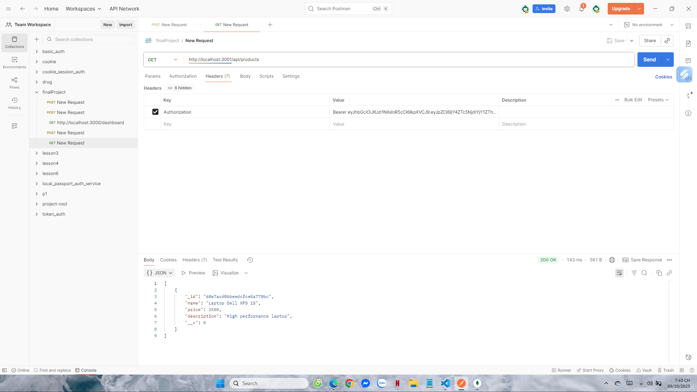

# Product Service

## Giới thiệu
Service `product` chịu trách nhiệm **quản lý sản phẩm**, bao gồm:
- Tạo sản phẩm mới  
- Lấy danh sách sản phẩm  
- (Tạo đơn hàng khi Order Service hoạt động)

Tất cả API trong service đều được bảo vệ bằng **JWT Token** thông qua middleware `isAuthenticated`.

---

## Cách chạy

1. Cài đặt thư viện:
   ```bash
   npm install
   ```

2. Tạo file `.env` trong thư mục `product/` với nội dung:
   ```env
MONGODB_AUTH_URI=
JWT_SECRET=ysecretkey
MONGODB_PRODUCT_URI=
LOGIN_TEST_USER=
LOGIN_TEST_PASSWORD=
   ```

3. Chạy service:
   ```bash
   node index.js
   ```

4. Nếu chạy thành công, console hiển thị:
   ```
   MongoDB connected
   Product service running on port 3001
   ```

---

## Part A: Đăng nhập để lấy Token (`/login` từ Auth Service)

### Request
```http
POST http://localhost:3000/login
Content-Type: application/json
{
  "username": "user1",
  "password": "12345"
}
```

### Kết quả test
- **Đăng nhập thành công**, trả về token JWT  
  

---

## Part B: Tạo sản phẩm mới (`POST /`)

### Request
```http
POST http://localhost:3001/
Content-Type: application/json
Authorization: Bearer <token>
{
  "name": "Laptop Dell XPS 15",
  "description": "High performance laptop",
  "price": 2500
}
```

### Kết quả test
- **Tạo sản phẩm thành công** → `201 Created`  
  

- **Thiếu thông tin (ví dụ thiếu name)** → `400 Bad Request`  
  

---

## Part C: Lấy danh sách sản phẩm (`GET /`)

### Request
```http
GET http://localhost:3001/
Authorization: Bearer <token>
```

### Kết quả test
- **Thành công** → trả về mảng sản phẩm  
  

---

## Part D: Tạo đơn hàng (`POST /buy`) – *Test sau khi Order Service hoạt động*

### Request
```http
POST http://localhost:3001/buy
Authorization: Bearer <token>
{
  "productId": "<id_sản_phẩm>",
  "quantity": 2
}
```

### Kết quả test
- **Khi Order Service hoạt động** → trả về `"Order created successfully"`  
  
---

## Part E: Truy cập không có token

### Request
```http
GET http://localhost:3001/
```

### Kết quả test
- **Không có token** → `401 Unauthorized`  
  

---

## Cấu trúc thư mục
```
product/
│
├── index.js
├── .env
├── package.json
├── public/
│   └── results/
│       ├── login_product_token.png
│       ├── create_product_success.png
│       ├── create_product_fail.png
│       ├── get_products.png
│       ├── buy_product_success.png
│       └── no_token.png
└── src/
    ├── app.js
    ├── config.js
    ├── controllers/
    │   └── productController.js
    ├── routes/
    │   └── productRoutes.js
    ├── utils/
    │   ├── isAuthenticated.js
    │   └── messageBroker.js
    ├── repositories/
    ├── services/
    └── test/
```

---
